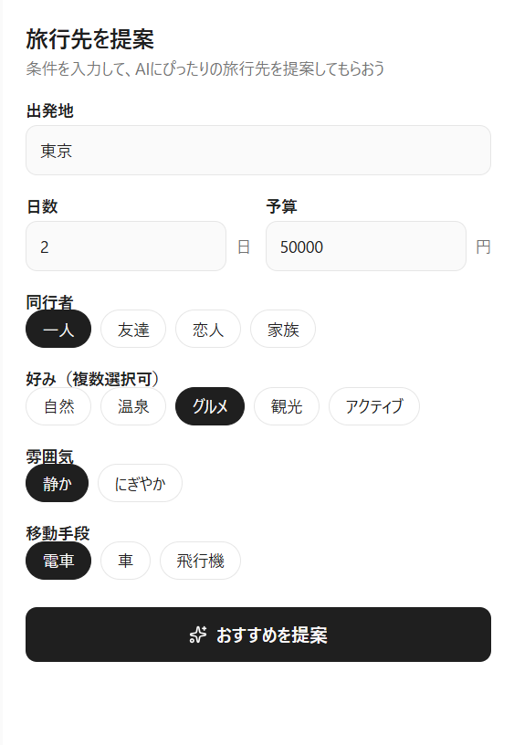
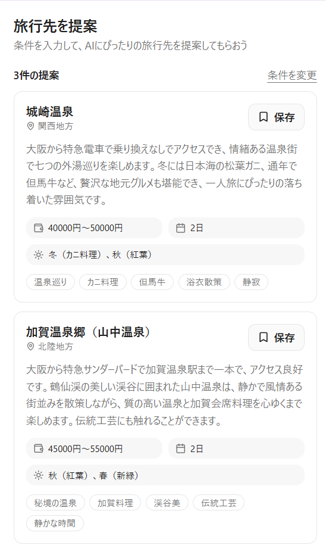

# AI旅行先提案アプリ

条件を入力すると、AIが最適な旅行先を提案するWebアプリです。

---

## デモ

https://あなたのURL.vercel.app

---

## アプリ画面

### トップ画面


### 結果画面


---

## 主な機能

- 旅行条件の入力
- AIによる旅行先提案
- 旅行先の詳細情報表示
- 保存機能

---

## 使用技術

| 技術 | 用途 |
|---|---|
| Next.js | フロントエンド |
| TypeScript | 型安全な開発 |
| TailwindCSS | UIデザイン |
| Gemini API | AI旅行提案 |
| Vercel | デプロイ |
| GitHub Actions | CI |
| DevTools | デバッグ |

---

## コード例

### API（旅行先生成）

```ts
import { generateObject } from "ai"
import { google } from "@ai-sdk/google"
import { z } from "zod"

const recommendationSchema = z.object({
  recommendations: z.array(
    z.object({
      name: z.string(),
      area: z.string(),
      reason: z.string(),
      estimatedBudget: z.string(),
      days: z.string(),
      bestSeason: z.string(),
      tags: z.array(z.string())
    })
  )
})

export async function POST(req: Request) {

  const body = await req.json()

  const result = await generateObject({
    model: google("gemini-2.5-flash"),
    prompt: "旅行先を提案してください",
    schema: recommendationSchema
  })

  return Response.json(result.object)
}
